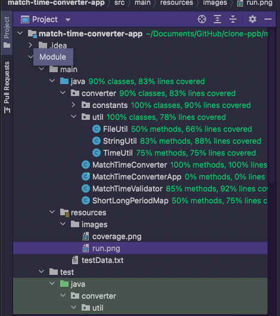
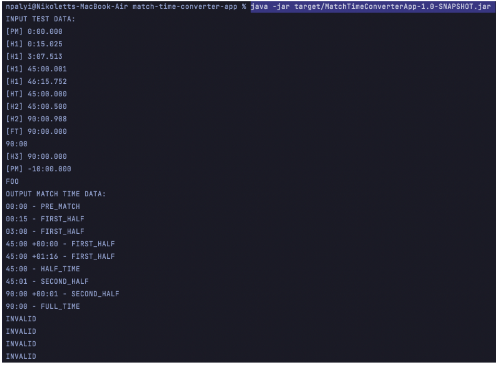

# Match time converter CLI Java application

## Description
It is a Java command line converter application that can take a String representing match time in one format and convert it to a String representing match time in another specified format. It can read the supplied test data file and output the result to the command line. Instructions are below in README.

The input match time is in the format:
```
[period] minutes:seconds.milliseconds
```
The output should be in the format:
```
normalTimeMinutes:normalTimeSeconds - period
```
For the output format, minutes should be padded to two digits and milliseconds should be rounded
up or down to the nearest whole second. 
Periods are represented in short-form on the input format and long-form on output format i.e.\
|Short form | Long Form  |
| --------- | ---------- |
|PM         | PRE_MATCH  |
|H1         | FIRST_HALF |
|HT         | HALF_TIME  |
|H2         | SECOND_HALF|
|FT         | FULL_TIME  |

When a given period goes into additional time (i.e. > 45:00.000 for first half, > 90.00.000 for the second half), 
the added minutes and seconds are represented separately in the format.

```
normalTimeMinutes:normalTimeSeconds +additionalMinutes:additionalSeconds - period
```

Any input which does not meet the required input format should result in an output of "INVALID"

## Examples

| Input            | Expected Output              |
| -------------    | -------------                |
| "[PM] 0:00.000"  | "00:00 – PRE_MATCH"          |
| "[H1] 0:15.025"  | "00:15 – FIRST_HALF"         |
| "[H1] 3:07.513"  | "03:08 – FIRST_HALF          |
| "[H1] 45:00.001" | "45:00 +00:00 – FIRST_HALF"  |
| "[H1] 46:15.752" | "45:00 +01:16 – FIRST_HALF"  |
| "[HT] 45:00.000" | "45:00 – HALF_TIME"          |
| "[H2] 45:00.500" | "45:01 – SECOND_HALF"        |
| "[H2] 90:00.908" | "90:00 +00:01 – SECOND_HALF" |
| "[FT] 90:00.000" | "90:00 – FULL_TIME"          |
| "90:00"          | "INVALID"                    |
| "[H3] 90:00.000" | "INVALID"                    |
| "[PM] -10:00.000"| "INVALID"                    |
| "FOO"            | "INVALID"                    |

## File structure

```
match-timeconverter-app
│   README.md
│   ... 
│
└───src
│  │ │
│  │ └main
│  │ └java
│  │  └converter
│  │  │      │
│  │  │     MatchTimeConverterApp.java
│  │  │     MatchTimeValidator.java
│  │  │     ShortLongPeriodMap.java
│  │  │     MatchTimeConverter.java
│  │  │
│  │  └───constants
│  │  │   │    ConverterConstants.java  
│  │  │   └───enums
│  │  │        LongOutputPeriod.java
│  │  │        ShortInputPeriod.java            
│  │  │   
│  │  └───util
│  │        FileUtil.java
│  │        StringUtil.java
│  │        FileUtil.java  
│  │
│  └test
│     ...
│
└pom.xml
```
Plan:
1. Creating a CLI app
2. Read an input file
3. Converting and formatting String with time content
4. Validation
5. Unit testing

## Unit Testing

Unit Testing Coverage: 90% classes, 83% lines covered



Used tech: Java 8, Maven, JUnit 5, SonarQube tool, Maven fmt plugin


## Instructions for running
Required installation: Java 8, Maven

1. Download and unzip or clone the code repository, https://github.com/nikpalyi/match-time-converter-app/archive/refs/heads/main.zip
2. In Terminal or Command Prompt, enter the repository's folder: 
```
cd match-time-converter-app-main
```
or
```
cd match-time-converter-app
```
3. Run 
```
mvn clean install
```
4. Run
```
mvn clean package
```
5. Run 
``` 
java -jar target/MatchTimeConverterApp-1.0-SNAPSHOT.jar
```
and press an Enter: It should print out the test data content and the converted data



